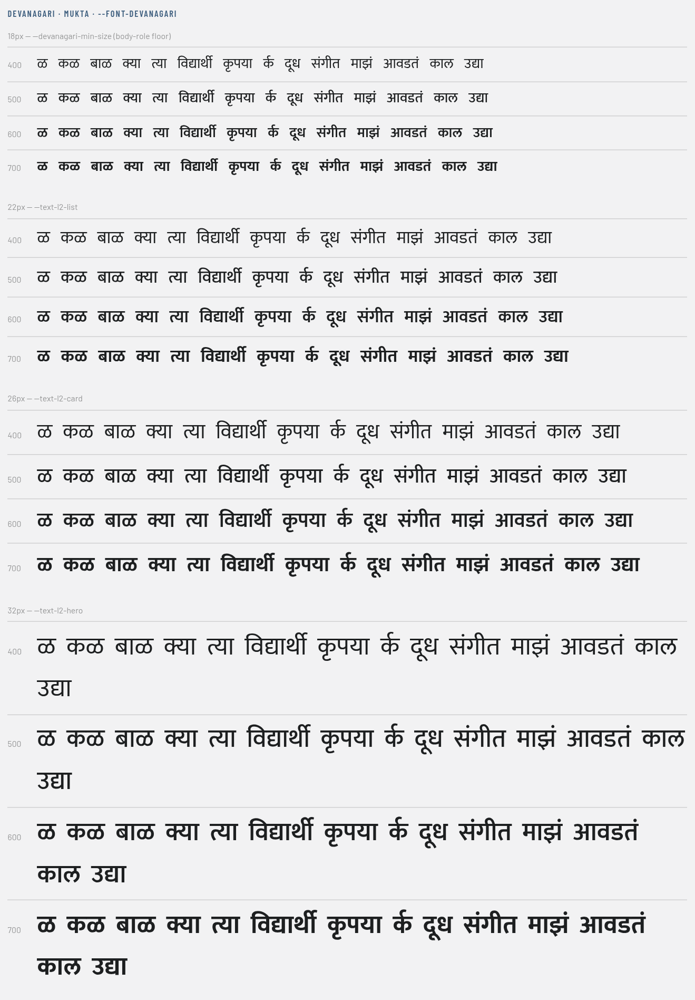
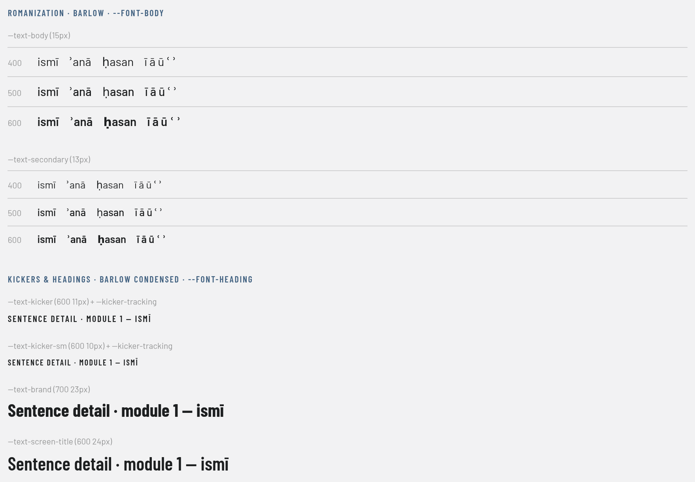
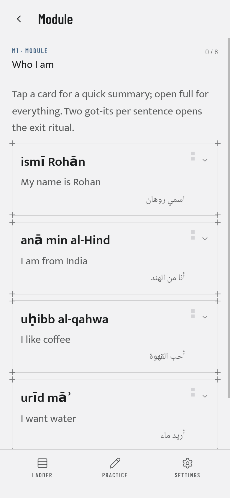
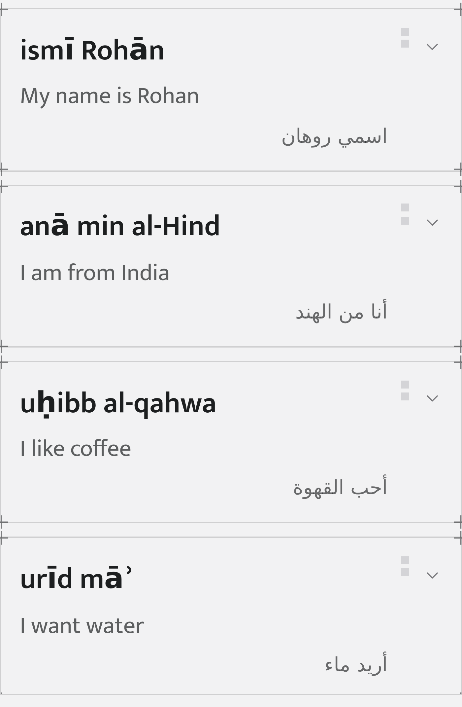
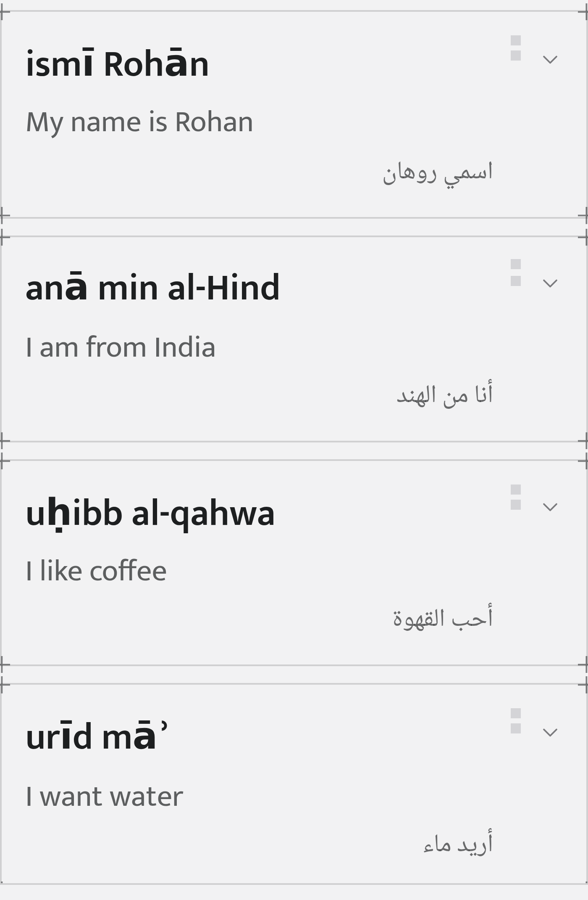

# Font notes — bundling Mukta + Barlow (#85), and Noto Naskh Arabic (#197)

Findings from self-hosting the product faces [D15]. This file is in `docs/`, not
`design/`: `design/font-notes.md` is design-owned, and `design/` is re-copied wholesale from
Rishabh's tooling, which wipes anything added to it (`docs/design-contract.md`).

§1–§7 are #85's three faces. **§8 is the fourth**, added when Arabic shipped — and it is also
where the one engineering override of a `design/tokens.css` value is written down.

**Verdict in one line:** every Devanagari specimen renders in Mukta at every ramp size and
weight, including the 18px floor; `ī ā ū` render in Barlow, but **`ʾ` (U+02BE), `ʿ` (U+02BF) and
`ḥ` (U+1E25) are not in Barlow or Barlow Condensed** and fall back to a system face; the bundle
ships **823,736 bytes (804 KiB) of woff2**, unsubset, for #113 to cut.

---

## 1. What ships

| Package | Weights | Why those |
|---|---|---|
| `@fontsource/mukta` | 400 · 500 · 600 · 700 | tokens.md §2 puts Mukta at 400–700 for **all** Devanagari. The ramp uses 400 (`--text-l2-cue`), 600 (`--text-l2-card`, `--text-l2-list`) and 700 (`--text-l2-hero`); 500 is design headroom and is unused today. |
| `@fontsource/barlow` | 400 · 500 · 600 | The ramp only asks for 400 (body, secondary, caption, micro); 500/600 are the UI headroom the ticket names. |
| `@fontsource/barlow-condensed` | 500 · 600 · **700** | 600 is `--font-heading-weight` (screen/rung/verdict titles, kickers). **700 is not in the ticket's list but `--text-brand: 700 23px/1 var(--font-heading)` is** — the wordmark. Without it the browser synthesises a bold and nothing says so, which is the exact failure [D15] is about. Verified in the built app: the header pulls `Barlow Condensed 700`. |

Imported one line per face in `src/main.tsx`. `font-display: swap` comes from @fontsource and is
asserted in `src/fonts.test.ts`.

**`src/fonts.test.ts` is the guard that keeps this honest.** It parses the `--text-*` shorthands
in `design/tokens.css` into the set of (family, weight) pairs the product actually renders, and
fails if `main.tsx` does not import one of them. A ramp entry that changes 600 → 700 turns it red
instead of quietly shipping a synthesised face.

### woff2 only

@fontsource writes a `.woff` fallback beside every `.woff2`, and Vite emits an asset for every
`url()` it can resolve — so `dist/` carried both until `vite.config.ts` grew a 12-line `pre`
transform (`rung-woff2-only`) that strips the fallback from @fontsource's stylesheets. The
product's browser targets are Chrome Android and Safari iOS current-1 (PRD §10), both of which
have shipped woff2 since 2016, and the service worker (#92) precaches everything — so every
unused byte in `dist/` is a byte a phone downloads.

    $ find dist -name '*.woff' -o -name '*.ttf' -o -name '*.otf' | wc -l
    0

## 2. The `/dev/type` specimen

`src/dev/TypeSpecimen.tsx`, reachable at `#/dev/type` **in development only**. It renders the
Devanagari matrix (14 specimens × 18/22/26/32px × 400/500/600/700, every size from the ramp token
that owns it), the romanization diacritics in Barlow at 15px and 13px × 400/500/600, and the
Barlow Condensed kickers with `--kicker-tracking`.

Two things about it are deliberate:

- **It never ships.** `src/dev/typeRoute.tsx` imports it dynamically inside an
  `import.meta.env.DEV` branch, so a production build never puts the module in the graph. A
  *static* import is not enough: Rollup tree-shakes the component but Vite still emits a CSS
  module's stylesheet, and the first build of this ticket shipped `_specimen_`, `_s18_` and
  friends in `dist/assets/index-*.css`. With the dynamic import there is no chunk and no CSS.
  In the built app `#/dev/type` renders the Ladder (the `*` route redirects, hash rewritten to
  `#/`), and `grep -r 'TypeSpecimen\|dev/type' dist` finds nothing.
- **It is the single entry in the shell-purity allowlist** (`src/shellPurity.test.ts`). That
  guard fails on any course script under `src/`, and a font specimen exists to render one. The
  exemption is safe because the file never reaches a build, not because the text is "only a
  specimen" — the list stays exactly one long and the pattern was not widened.

## 3. Devanagari — no tofu anywhere



The verifying machine has **no system Devanagari font at all** (`fc-list` = 8 DejaVu faces), so
before this ticket every Devanagari glyph in the app was a box. That makes the check unusually
strict: anything Mukta does not draw shows up immediately.

Method — headless Chromium 1232 over CDP, one probe span per (size, weight, specimen) styled
through the tokens, then `CSS.getPlatformFontsForNode` for each, which reports the font the
renderer actually used and whether it was a custom (bundled) one:

| | |
|---|---|
| probes | 224 = 14 specimens × 4 sizes × 4 weights |
| drawn by the bundled face | **224 / 224** |
| fell back to a system font | 0 |
| fonts reported | `Mukta` (400), `Mukta Medium` (500), `Mukta SemiBold` (600), `Mukta` (700) — all `isCustomFont: true` |

Every specimen renders, at the 18px body-role floor as much as at 32px: the ळ Marathi needs, the
conjuncts क्या / त्या / विद्यार्थी / कृपया, the reph र्क, दूध, संगीत, the candrabindu in माझं / आवडतं, and काल /
उद्या. `document.fonts` confirms all four Devanagari faces load from our own origin.

## 4. Romanization diacritics — a real gap, documented



PRD §10 [D15]: *"ʾ/ḥ/ī diacritics of the romanization must render in Barlow — verify glyph
coverage, fall back to a diacritic-complete face if needed."* Verified, per character, the same
way:

| character | in Barlow? | in Barlow Condensed? |
|---|---|---|
| `ī` U+012B, `ā` U+0101, `ū` U+016B | **yes** | **yes** |
| `i` + combining macron U+0304 (the decomposed form) | **yes** | **yes** |
| `ʾ` U+02BE (modifier letter right half ring) | **no** — DejaVu Sans | **no** |
| `ʿ` U+02BF (modifier letter left half ring) | **no** — DejaVu Sans | **no** |
| `ḥ` U+1E25 (h with dot below) | **no** — DejaVu Sans | **no** |

Both families **declare** a `latin-ext` subset whose `unicode-range` covers all five
(`U+02BD-02C5`, `U+1E00-1E9F`) — the range is a routing hint, not a promise, and Barlow's
latin-ext simply has no glyph at those three codepoints. It is visible in the screenshot above:
in the 600 rows the `ḥ` and the `ʾ` stay in the system face while the letters beside them get
heavier.

**So: two of the three characters the PRD names by hand are missing.** It is not tofu — every
platform we target (iOS, Android, this Debian box) has a system face that covers them, so it
degrades to a *mismatched* glyph rather than a missing one. It also does not bite v1: the ticket
this gap belongs to is the romanized course (en-ar), and v1 ships hi-mr, whose L2 is Devanagari.

Options when it does bite, in order of cost:

1. Accept the fallback for the three marks and pin it in `--font-script-fallback` so the choice
   is deliberate rather than a browser's guess.
2. Author romanization with alternatives Barlow does cover (`ʼ` U+02BC is present; `h` with no
   dot loses the distinction).
3. Swap the body face for a diacritic-complete one, which is what [D15] authorises — a design
   decision, not an engineering one.

Whichever is chosen, it should be settled **before** #113 subsets, because subsetting is where
"which glyphs must survive" gets written down.

## 5. Bytes shipped

Unsubset, which is #113's ticket (subset per course at build time). Everything below is measured
from `dist/` after `npx vite build`.

| | bytes | KiB |
|---|---:|---:|
| **total (30 woff2 files)** | **823,736** | **804.4** |
| Mukta 400/500/600/700 | 557,588 | 544.5 |
| Barlow 400/500/600 | 133,780 | 130.6 |
| Barlow Condensed 500/600/700 | 132,368 | 129.3 |
| — by subset: devanagari | 413,148 | 403.5 |
| — by subset: latin | 217,648 | 212.5 |
| — by subset: latin-ext | 146,932 | 143.5 |
| — by subset: vietnamese | 46,008 | 44.9 |

`unicode-range` means a browser only downloads what a page needs — the built app's Ladder pulls
**5 files, 189 KiB** (Barlow 400 latin, Barlow Condensed 600 + 700 latin, Mukta 700 latin +
devanagari). The offline precache (#92) will take all 804 KiB, which is what makes #113 worth
doing.

Cuts for #113, cheapest first, with one caveat measured here:

| cut | saves | note |
|---|---:|---|
| all `vietnamese` subsets | 46,008 | nothing in this product is Vietnamese |
| Mukta `latin-ext` | 59,944 | Mukta's role is Devanagari; its Latin-ext is unreachable |
| Mukta 500 (all subsets) | 142,236 | no ramp token renders Mukta 500 today |
| Barlow Condensed `latin-ext` | 43,336 | only needed if a heading or kicker ever carries `ī`/`ā`/`ū` |
| per-course subset of Mukta devanagari | up to ~380,000 | the big one: hi-mr's word index is a few hundred glyphs, not the whole block |

**Caveat: do not drop Mukta's `latin` subset.** The Ladder's L2 line renders `3वाँ` — the digit
comes from Mukta's Latin subset, and dropping it would leave digits and ASCII punctuation inside
Devanagari strings rendering in a system face.

## 6. Network — nothing is fetched at runtime

| | requests | external | `.woff2` | `.woff` |
|---|---:|---:|---:|---:|
| dev server, `#/dev/type` (uses every face) | 77 | **0** | 13 | 0 |
| built app (`vite preview`), Ladder | 12 | **0** | 5 | 0 |

`grep -ri 'fonts.googleapis\|fonts.gstatic' dist` → nothing, and `src/fonts.test.ts` fails on any
font host named in `src/` or `index.html`. (The Arabic quiet line was still `--font-script-fallback`
= system-ui when this was measured; §8 is [D15]'s "if en-ar ships" clause, now taken.)

## 7. Reproducing

```bash
npm run dev                 # then open http://localhost:5173/#/dev/type
bash scripts/verify.sh      # TYPES ok | LINT ok | TEST 399/399 ok | CONTENT ok | BUILD ok
find dist -name '*.woff2' -printf '%s\n' | awk '{s+=$1} END {print s}'   # 823736
find dist \( -name '*.woff' -o -name '*.ttf' -o -name '*.otf' \) | wc -l # 0
grep -ri 'fonts.googleapis\|fonts.gstatic' dist | wc -l                  # 0
```

The per-glyph attribution is a CDP session against the running dev server: render one probe span
per (role, weight, size, character) and call `CSS.getPlatformFontsForNode` on each — a bundled
face reports `isCustomFont: true` with its own name, a fallback reports the system font by name.
A canvas-bitmap comparison is *not* a reliable substitute: it only sees faces the page has
already loaded, and on a multi-character string one covered letter hides an uncovered one.

---

## 8. Arabic — Noto Naskh Arabic, bundled and subset to content (#197)

**Verdict in one line:** the romanized courses' quiet native line now paints in a bundled
**Noto Naskh Arabic 400** (SIL OFL 1.1) in every place it renders; a learner on a Latin or
Devanagari course downloads **zero** bytes of it and precaches **2,348**; an Arabic learner
downloads **7,544** bytes today, and both budget rows the strict build gates stay green.

### 8.1 The face, and why it is allowed in the repo

| | |
|---|---|
| family | **Noto Naskh Arabic**, weight 400 only |
| package | `@fontsource/noto-naskh-arabic@5.3.0` (`arabic` subset file, 52,668 bytes woff2) |
| licence | **SIL Open Font License 1.1** — `node_modules/@fontsource/noto-naskh-arabic/LICENSE`, "Copyright 2022 The Noto Project Authors (https://github.com/notofonts/arabic)" |
| may we bundle it? | **Yes.** OFL §2 permits the font to be "bundled, embedded, redistributed and/or sold with any software" with no royalty, provided the copyright notice and licence travel with it (they do: the package ships `LICENSE`, and `npm ci` reproduces it) and provided we do not sell the font on its own or ship it under a Reserved Font Name. Noto Naskh Arabic declares **no** Reserved Font Name, so even the subsetting this build does — which is a Modified Version under OFL §1 — needs no rename. |
| why Naskh, not Kufi/Sans | `design/tokens.md` §2 asks for a Naskh by name. Naskh is the reading face for running Arabic prose; the quiet line is a sentence to be read, not a label. |

**One weight is the whole requirement.** All five `.script` rules are `font: var(--text-body)`
(400 15px/1.55) with only the family swapped, so 400 is what renders and 500/600/700 would be
dead payload — the same argument that cut Mukta 500 in #113. `src/fonts.test.ts` derives that
pairing from the stylesheets rather than trusting this paragraph: any rule that takes a `--text-*`
shorthand and overrides `font-family` contributes its (family, weight) to the bundle requirement.

### 8.2 The divergence from `design/tokens.css`, recorded

`design/` is read-only and re-copied wholesale, so the token cannot be edited where it lives. The
override is `src/styles/tokenOverrides.css`, imported in `main.tsx` **immediately after**
`design/tokens.css` so it wins on order alone — the same shape as PR #189's web-app-manifest `lang`
divergence in `docs/05-pwa-notes.md` §3.

| token | `design/tokens.css` | the app | why |
|---|---|---|---|
| `--font-script-fallback` | `system-ui, sans-serif` — with the standing instruction *"Arabic quiet line (bundle Naskh if ar ships)"* | `"Noto Naskh Arabic", system-ui, sans-serif` | ar has shipped; the instruction is taken |

`system-ui` deliberately **stays behind** the named face: the subset's `unicode-range` claims the
Arabic block, the joiners and the space, and nothing else, so a Latin character or a digit inside
a script line still resolves exactly as it did before this ticket. `src/fonts.test.ts` fails if
the stack ever loses its named face, if `design/tokens.css` ever tries to carry the family itself,
or if the override is imported before the tokens; `src/styleContract.test.ts` keeps the override
register one file long.

### 8.3 The subset

`tools/font-subset.ts` gained one `ScriptTarget`, and nothing else changed shape — the harvest,
the dev/strict split and the "generated woff2 are gitignored" rule are #113's, unaltered:

- **covers** `U+0020`, `U+0600-06FF`, `U+0750-077F`, `U+0870-08FF`, `U+200C-200E`, `U+FB50-FDFF`,
  `U+FE70-FEFC` — the Arabic block and neighbours, the presentation forms a shaper may reach for,
  and the joiners.
- **baseline** (always present): space, `،` `؛` `؟`, the Arabic-Indic digits `٠`–`٩`, tatweel,
  ZWNJ/ZWJ. No letters — content decides those, the rule Mukta's Latin baseline follows.
- **the space is deliberate.** Without `U+0020` a four-word Arabic line is set in two faces —
  Naskh for the words, the system face for the gaps — which is measurable in the attribution below
  (`DejaVu Sans ×1` per space) and visible as slightly loose spacing. It only ever applies where
  this family is named, i.e. the five `.script` rules.
- **Naskh's own `latin` subset is NOT bundled.** It would roughly double the Arabic learner's font
  cost to re-draw characters Barlow already draws well, for text that is not the line's job.

GSUB closure does the heavy lifting: HarfBuzz keeps every initial/medial/final/isolated form and
every ligature composable from the retained letters, so `اسمي` shapes and joins correctly from the
four base codepoints — the Arabic analogue of #113's conjuncts.

### 8.4 Bytes, exactly

Measured from `dist/` after `npx vite build`, source file 52,668 bytes:

| build | Arabic content shipped | Naskh woff2 in `dist/` | downloaded by the learner | precached |
|---|---|---:|---:|---:|
| **strict / learner** (`npm run build` → hi-mr only) | none — en-ar is `fixture: true` | **2,348** | **0** | 2,348 |
| **dev** (`--with-fixtures` → hi-mr, en-es, en-ar) | en-ar L1-M1, 4 sentences / 6 script lines | **7,544** | 7,544 (Arabic course) · **0** (hi-mr, en-es) | 7,544 |

**Downloaded = 0 for a non-Arabic course is not an estimate.** `unicode-range` means the browser
fetches a face only when the page paints a codepoint the range claims; a CDP request log over
hi-mr and en-es shows zero requests for the Naskh woff2, and one for en-ar (§8.5). What a
non-Arabic learner does pay is the **service-worker precache**, which takes all of `dist/`
(#90/#92): **2,348 bytes**, 0.6 % of the font budget.

Against the two budget rows `tools/payload-budget.ts` gates (`scripts/verify.sh`, strict build):

| row | before #197 | after #197 | limit | |
|---|---:|---:|---:|---|
| `fonts` (raw woff2) | 361.2 KiB | **363.5 KiB** | 380 KiB | ok, +2.3 KiB |
| `total` (gzip, first visit) | 548.1 KiB | **550.8 KiB** | 580 KiB | ok, +2.7 KiB |

**No limit was raised.** The dev build — which the gate does not meter — is a different story and
is not this ticket's to fix: it was already **597.7 KiB** against the 580 KiB `total` limit after
Spanish M3–M5, and this change takes it to **605.2 KiB**. That row is #207's (per-course
measurement); metering three courses' content against a budget written for one is the bug, and
raising the limit to hide it would delete the tripwire.

**How it scales.** 2,348 bytes is the floor (baseline glyphs and font tables); 7,544 is four
sentences. The marginal cost is per *distinct character*, not per sentence, and Arabic's alphabet
is 28 letters plus diacritics — so #199–#201 filling out en-ar L1 will converge on roughly the
size of the whole `arabic` subset's letter repertoire, an order of magnitude below Devanagari's
~86–90 KiB per weight (Devanagari pays for conjunct closure; Arabic's joining forms are far
fewer). Expect low tens of KiB at full L1, on one weight rather than three.

### 8.5 Rendering evidence

Dev build (`npm run dev`, en-ar active), headless Chromium 151 over CDP at 390×844 dpr 2. The
verifying box has no Naskh installed — `fc-list :lang=ar` finds only DejaVu Sans — so any glyph
not drawn by the bundle is attributable by name.



**1. The face loads, and it is ours.** `document.fonts` reports `Noto Naskh Arabic 400` as
`loaded`, from our own origin; the request log shows `200 noto-naskh-arabic-arabic-400.woff2` and
no external font host.

    document.fonts.check('400 15px "Noto Naskh Arabic"', 'اسمي روهان')   // true

(Asked *with the string*: `check()` with no text probes `BESbwy`, which is outside the Arabic
`unicode-range` and answers `true` for any family — a trap worth naming.)

**2. Glyph-width comparison**, the technique #190 used for Mukta — the same string, the same
`400 15px/1.55`, three stacks:

| stack | width of `اسمي روهان` |
|---|---:|
| `'Noto Naskh Arabic', system-ui, sans-serif` | **67.73 px** |
| `'Nope Not A Font', system-ui, sans-serif` | 80.67 px |
| `system-ui, sans-serif` | 80.67 px |

A missing family and the bare system stack measure identically; the bundled face does not. The
line is being drawn by something the page brought with it.

**3. Per-node attribution** — `CSS.getPlatformFontsForNode`, which reports the face the renderer
actually used and whether it was a custom (bundled) one. Every glyph of every Arabic line:

| surface | route | glyphs from the bundled face | from a system face |
|---|---|---:|---:|
| `SentenceCard` (module list) ×4 | `#/module/L1-M1` | 12, 16, 14, 10 | **0** |
| `SentenceScreen` | `#/sentence/L1-M1-S01` | 12 | **0** |
| `ReadPhase` | `#/practice` (read) | 12 | **0** |
| `RevealCard` | `#/practice` (reveal) | 12 | **0** |

Four of the five `.script` rules, observed live. The fifth, `ComprehensionItem`, sits behind the
exit ritual (two got-its per sentence) and could not be reached by script; it carries the
byte-identical rule against the same token, and `src/fonts.test.ts` asserts all five resolve to a
face the bundle carries. Before the space joined the subset the same probe read
`DejaVu Sans ×1 + Noto Naskh Arabic ×11` — one system glyph per word gap, which is what §8.3's
`U+0020` fixed.

**4. Before / after, same DOM.** Setting `--font-script-fallback` back to its design value live
(`system-ui, sans-serif`) flips every line to `DejaVu Sans ×10-12`, all system:

| | |
|---|---|
|  |  |

**5. The other two courses are untouched.** hi-mr and en-es render zero `.script` lines (they are
`scriptMode: 'native'`), fetch **zero** Naskh bytes, and their Mukta/Barlow attribution is
unchanged.

### 8.6 Reproducing

```bash
npm run build && npm run budget      # BUDGET fonts 363.5 KiB ok | total 550.8 KiB ok
find dist -name 'noto-naskh*' -printf '%s\n'                          # 2348 (strict)
npm run dev                          # then Settings → english → arabic → any module
```

The attribution is a CDP session against the dev server: `CSS.getPlatformFontsForNode` on each
`.script` node. A screenshot alone is not proof — DejaVu Sans draws Arabic, badly, without tofu —
which is why the width comparison and the per-node attribution are both here.
