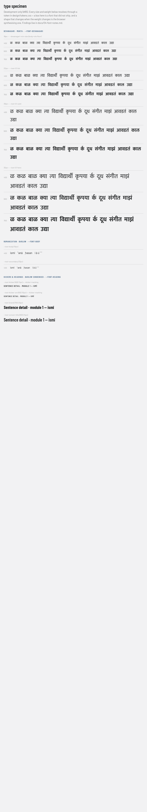

# Perf notes — font subsetting per course, the payload budget, the first-load pass (#113, #114)

Created by #113, per PRD-engineering §10 [D15] ("subset per course at build time") and
design/pwa-checklist.md §2. Starting point: docs/04-font-notes.md §5, which measured the unsubset
bundle and named the cuts. #114 (first load ≤ 2s) extends the budget table this ticket introduced.

**Verdict in one line:** the learner build's font payload went from **823,736 bytes (804.4 KiB,
30 files)** to **101,480 bytes (99.1 KiB, 9 files)** — under the ≤ 150 KiB budget, enforced on
every `scripts/verify.sh` run by `tools/payload-budget.ts` — and `/dev/type` renders the full
matrix in the subset faces with zero tofu at the 18px floor.

> **2026-08-13.** The 99.1 KiB figure was measured against a learner build that shipped **no
> modules**, so the Devanagari subsets were near-empty. hi-mr L1-M1…M10 now ship and the same
> build measures **361.2 KiB (9 files)**; §4 records the tripwire firing and the rebalanced
> limits. The subsetting itself is unchanged — this is content arriving, not a regression.

---

## 1. Before / after

Before, per face, as #85 measured it (docs/04-font-notes.md §5 — 30 woff2 in `dist/`, every
@fontsource subset of every imported weight):

| face                          | weights         |   bytes |
| ----------------------------- | --------------- | ------: |
| Mukta (dev + latin + ext)     | 400·500·600·700 | 557,588 |
| Barlow (latin + ext + viet)   | 400·500·600     | 133,780 |
| Barlow Cond (latin+ext+viet)  | 500·600·700     | 132,368 |
| **total**                     |                 | **823,736** |

After, per file, a strict learner build (`npx vite build` after the strict `content:build`):

| file                                  |   bytes | where it comes from                        |
| ------------------------------------- | ------: | ------------------------------------------ |
| barlow-latin-400-normal               |  22,196 | @fontsource, whole `latin` subset          |
| barlow-condensed-latin-600-normal     |  22,308 | @fontsource, whole `latin` subset          |
| barlow-condensed-latin-700-normal     |  22,444 | @fontsource, whole `latin` subset          |
| mukta-devanagari-400 / 600 / 700      | 4,220 / 4,288 / 4,124 | `tools/font-subset.ts`, per course |
| mukta-latin-400 / 600 / 700           | 7,108 / 7,268 / 7,524 | `tools/font-subset.ts`, per course |
| **total (9 files)**                   | **101,480** | `BUDGET fonts 99.1 KiB ≤ 150.0 KiB ok` |

The service worker precache lists exactly these nine woff2 and nothing else — no `.woff`, no
`latin-ext`, no `vietnamese` anywhere in `dist/` (#90; the precache globs are unchanged, the
files behind them shrank).

## 2. The cuts, and who authorised each

1. **Weights trimmed to the ramp** — the `--text-*` shorthands in design/tokens.css render
   exactly Mukta 400/600/700, Barlow 400, Barlow Condensed 600/700. Mukta 500, Barlow 500/600
   and Barlow Condensed 500 were bundled headroom nothing rendered; `src/fonts.test.ts` now
   fails on unused faces in either direction (missing AND surplus), so headroom cannot creep
   back silently.
2. **Whole-family imports replaced by subset files** — `main.tsx` imports
   `@fontsource/<pkg>/latin-<weight>.css` instead of `<weight>.css`, which kills every
   `vietnamese` subset (nothing in this product is Vietnamese) and every `latin-ext` in the
   production graph.
3. **latin-ext is dev-only** — the romanization diacritics (ī ā ū) belong to the en-\* fixture
   courses and `/dev/type`, and fixtures only ship in dev builds — so `main.tsx` pulls the three
   `latin-ext` files via dynamic import inside an `import.meta.env.DEV` branch (the
   `typeRoute.tsx` pattern; never in a production graph). The PRD's other named marks (ʾ U+02BE,
   ʿ U+02BF, ḥ U+1E25) have **no glyph in Barlow at all** — that gap and its three options are
   docs/04-font-notes.md §4, and the decision stays with the en-ar course ticket. Subsetting
   changes nothing about it.
4. **Mukta glyph-subset per course at build time** — `tools/font-subset.ts` (HarfBuzz via
   `subset-font`), chained after `content:build` in `predev`, `prebuild` and `verify.sh`. It
   harvests every JSON string value the content build emitted per course, unions the per-course
   repertoires, and subsets each shipped weight of each script file. Baselines that always ride:
   danda/double danda, both digit sets, ZW(N)J, and ASCII digits+punctuation in the latin file —
   the Ladder's `3वाँ` digit comes from Mukta latin (docs/04-font-notes.md §5's caveat). Dev
   builds also fold in the `/dev/type` specimen repertoire, read from `TypeSpecimen.tsx`'s
   source, so the matrix page and the subset can never disagree in the one build kind that has
   the page. Barlow/Barlow Condensed are **not** glyph-subset: they render open-ended shell
   English, which is not knowable from content — their whole `latin` files (~22 KiB each) are the
   price of never showing a fallback glyph in UI chrome.

## 3. `/dev/type` post-subset



Verified on a machine with **zero** system Devanagari fonts (`fc-list :lang=mr` → 0, same as
#85's run), so every Devanagari glyph on screen is the subset Mukta by elimination: at 18px
(the `--devanagari-min-size` floor) through 32px × 400/600/700, all 14 specimens render — ळ, the
conjuncts क्या/त्या/विद्यार्थी/कृपया, the reph र्क, संगीत, the candrabindu माझं/आवडतं — which is also the
proof that HarfBuzz's GSUB closure kept the conjunct and matra forms the subset text implies.
Diacritics state, unchanged from #85: ī ā ū render in Barlow (dev builds; latin-ext), ʾ ʿ ḥ fall
back to a system face because Barlow has no such glyphs (§2.3 above).

## 4. The budget, and the tripwire (fired 2026-08-13)

`tools/payload-budget.ts` gates every full `verify.sh` run right after BUILD: one line
(`BUDGET fonts 361.2 KiB ≤ 380.0 KiB ok — 9 files`), exit 60 with the files heaviest-first when
blown. #114 adds rows to `BUDGETS` (JS, total precache) with zero new plumbing.

**The tripwire this section predicted has fired.** It read: the budget holds partly because the
native gate (#64) keeps every module out of the learner build, so the strict Devanagari subsets
are near-empty; hi-mr's authored content is 55 distinct Devanagari characters whose conjunct
closure subsets to ~84–89 KiB per weight, so the day modules ship, `fonts` lands around ~360 KiB
and BUDGET goes red — deliberately.

On **2026-08-13** hi-mr L1-M1…M10 were flipped `verified: true` on the repo owner's explicit
authority, backed by an LLM review rather than the native gate (#110, #111 — both still open,
see docs/07-llm-review-\*). The learner build now ships all ten modules, the subsets grew with
them, and both rows went over:

| row     | before (empty learner build) |     now | old limit | new limit |
| ------- | ---------------------------: | ------: | --------: | --------: |
| `fonts` |                     99.1 KiB | 361.2 KiB |  150 KiB |   380 KiB |
| `total` |                    204.4 KiB | 548.1 KiB |  400 KiB |   580 KiB |

**The rebalance, taken in this section's own order:**

1. _Drop a Mukta weight with design sign-off_ — not taken. 400/600/700 are exactly what the
   `--text-*` ramp renders (§2), and no design sign-off exists to cut one; `src/fonts.test.ts`
   would go red the moment the ramp asked for a weight the subsetter stopped emitting.
2. _Subset to the shipped modules' word index rather than all authored strings_ — no saving.
   Every authored hi-mr module now ships, so the two sets are identical.
3. _Raise the limit with a written justification here, which #113's acceptance explicitly
   allows_ — **taken.** New limits are the measured payload plus ~5%, so both rows stay
   tripwires rather than ceilings: a fourth Mukta weight (+~88 KiB) or a regression to unsubset
   Mukta (557 KiB) still trips `fonts`.

**What it costs, honestly.** `total` meters the SW precache, i.e. everything a first visit
eventually downloads: at 548.1 KiB gzip that is ~3.0 s on Slow 4G (~180 KiB/s) instead of
~2.2 s. The **2 s TTI gate (§5) is unaffected** — `js` is unchanged at 94.2 KiB gzip, the CSS at
8.5 KiB, and the fonts that grew are `font-display` async, not render-blocking; what got slower
is finishing the offline precache, not first paint or first interaction. If that becomes the
constraint, the next lever is loading Devanagari weights on demand (hero 700 first) rather than
precaching all three.

## 5. First load ≤ 2 s on mid-range Android (#114)

**Verdict in one line:** the deployed build passes the PRD §10 gate as it stands — Lighthouse
mobile perf **98–100**, TTI **1.5–1.8 s** on the throttled profile — so this pass shipped **no
app-code changes** (the issue's own rule: measurement-driven fixes only) and instead locked the
result in as two new budget rows, `js` and `total` (§6).

### 5.1 Baseline — and, with no fixes needed, also the "after"

Three Lighthouse 12 runs (headless Chromium, this repo's Playwright cache) against the deployed
URL `https://rishabh7g.github.io/rung/`, Lighthouse's default mobile profile — the issue's target
device class: mid-range-Android CPU (4× slowdown), simulated Slow 4G (RTT 150 ms, 1.6 Mbps),
412×823 viewport:

| run | perf score | FCP     | LCP     | TTI     | TBT  | CLS    |
| --- | ---------: | ------: | ------: | ------: | ---: | -----: |
| 1   |         99 | 1.63 s  | 1.78 s  | 1.78 s  | 0 ms | 0.001  |
| 2   |        100 | 1.38 s  | 1.53 s  | 1.53 s  | 0 ms | 0.002  |
| 3   |         98 | 1.73 s  | 1.73 s  | 1.73 s  | 0 ms | 0.000  |

Acceptance asks ≥ 90 and ≤ 2 s: worst run is 98 and 1.78 s. Zero blocking time — the bundle
parses inside the paint budget even at 4× CPU.

What the first paint actually transfers (run 1's network log, gzip on the wire):

| resource                         | transfer | note                                          |
| -------------------------------- | -------: | --------------------------------------------- |
| index.html                       |  1.3 KiB |                                               |
| assets/index-\*.js               | 85.6 KiB | the whole app — react-dom is 129 KiB raw of it |
| assets/index-\*.css              |  8.9 KiB |                                               |
| workbox-window                   |  2.3 KiB | SW registration shim                          |
| barlow latin-400 + cond-700      | 44.1 KiB | the only fonts the first screen needs         |
| manifest + courses.json + icons  |  2.3 KiB | courses.json is 20 bytes (native gate #64)    |

### 5.2 The audit, point by point

- **`font-display: swap`** — verified on all six Mukta faces (`src/fonts/mukta.css`) and every
  @fontsource face; text paints in the fallback and swaps, never blocks.
- **Preload the primary Mukta weight — measured, and declined.** The first screen is shell
  English: `unicode-range` routing means the browser fetches **zero Mukta files** before first
  paint (the network log above shows exactly two Barlow files). A preload would ADD Mukta bytes
  to the critical path of a paint that renders no Devanagari — strictly negative at today's
  numbers. Revisit only if a Devanagari-first screen ever becomes the boot route.
- **No double-bundling** — one-off `vite build --sourcemap` + `source-map-explorer` (not
  committed, per the issue): react-dom 129.0 KiB, app 89.6 KiB, react-router 37.5 KiB, react
  8.3 KiB, scheduler 3.9 KiB, lucide-react 3.7 KiB (tree-shaken from ~30 MB), zustand 2.5 KiB —
  raw, one copy of each, sums to the 275.7 KiB bundle.
- **SW registration not blocking first paint** — `registerServiceWorker()` runs in the module
  body, but `registerSW` only queues an async `navigator.serviceWorker.register`; TBT 0 ms is
  the receipt. `immediate: true` stays: precaching must start on the first visit, the only
  networked moment the product has.
- **Content JSON lazy** — `courses.json` (20 bytes) is the only pre-paint fetch;
  `levels/modules/words` load per screen through `src/course/content.ts`'s promise cache.
- **No speculative code-splitting** — JS is 92.9 KiB gzip against the issue's 200 KB ceiling and
  TTI is 1.5–1.8 s; the numbers do not demand a second chunk, so there isn't one.
- **Installability + offline unchanged** — this pass touched `tools/`, tests and docs only; the
  built artefact (bundle, sw.js, 20-entry precache) is byte-identical to the one the §3.6 gate
  walked in docs/05-pwa-notes.md §4, so that evidence stands.

### 5.3 Reproducing the measurement

```bash
CHROME_PATH=~/.cache/ms-playwright/chromium-1232/chrome-linux/chrome \
  npx -y lighthouse@12 https://rishabh7g.github.io/rung/ \
  --only-categories=performance \
  --chrome-flags="--headless=new --no-sandbox --disable-gpu" \
  --output=json --output-path=./lh.json --quiet
```

## 6. The budget table after #114 (and #115's splash row)

`tools/payload-budget.ts` now carries four rows, still one line each on every full
`scripts/verify.sh`:

| id     | meters                                   | measure | limit   | at baseline | with hi-mr L1 shipping |
| ------ | ---------------------------------------- | ------- | ------: | ----------: | ---------------------: |
| fonts  | every `.woff2`                           | raw     | 380 KiB |    99.1 KiB |              361.2 KiB |
| js     | every `.js` (bundle + workbox + sw)      | gzip    | 200 KiB |    92.9 KiB |               94.2 KiB |
| total  | everything in `dist/` but `icons/splash/`| gzip    | 580 KiB |   204.4 KiB |              548.1 KiB |
| splash | `icons/splash/` (#115's iOS startup set) | raw     | 100 KiB |    70.3 KiB |               70.3 KiB |

`gzip` meters transfer (GitHub Pages serves text assets gzip; `gzipSync` at the default level is
the approximation), `raw` meters disk — right for woff2 and PNG, which are already compressed.
`total` is honest as "the first visit" because the SW precache is all of `dist/` (§1) — with one
carve-out #115 added deliberately: the iOS splash set is **not** precached and never fetched by
the app (Safari pulls the single matching image at Add-to-Home-Screen, `docs/05-pwa-notes.md`
§11), so counting all eleven images against the first visit would be metering bytes no visit
transfers. They meter under their own `splash` row instead; `tools/payload-budget.test.ts`
asserts the two rows split `dist/` without losing a file. **§4's tripwire has now fired:** hi-mr
L1-M1…M10 ship (2026-08-13, owner-authorised LLM review — #110/#111), the ~+260 KiB of Devanagari
subsets sent `fonts` AND `total` red together, and §4 records the rebalance that raised the two
limits to 380/580 KiB. `total` now buys ~3.0 s of Slow 4G rather than ~2.2 s to finish precaching;
first paint and TTI are unchanged (§5).

## 7. Reproducing

```bash
npm run content:build && npm run fonts:build   # strict content, then the subsets from it
npx vite build && npm run budget               # BUDGET fonts … ok
bash scripts/verify.sh                         # TYPES ok | … | FONTS ok | BUILD ok | BUDGET ok
find dist -name '*.woff2' -printf '%s %p\n'    # the nine files of §1
npm run dev                                    # http://localhost:5173/#/dev/type — §3's matrix
```
