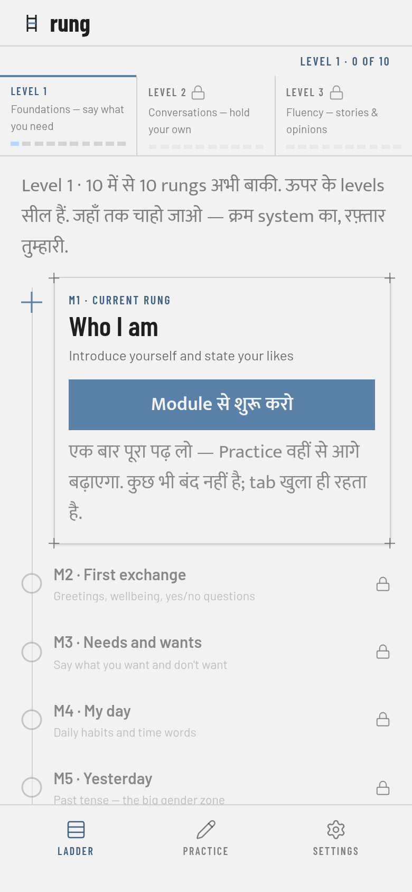
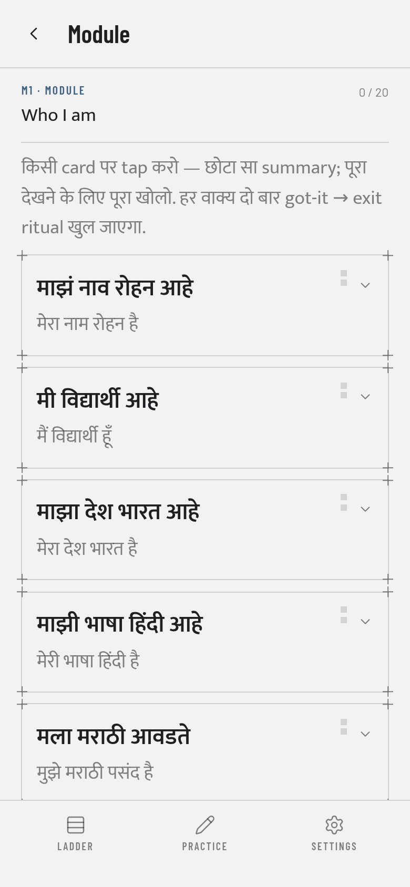
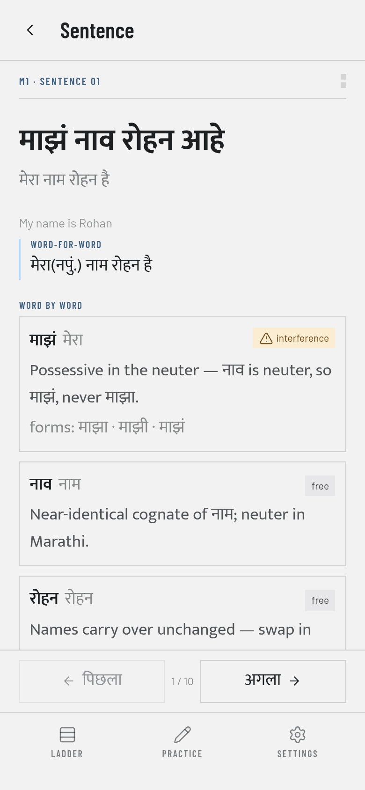
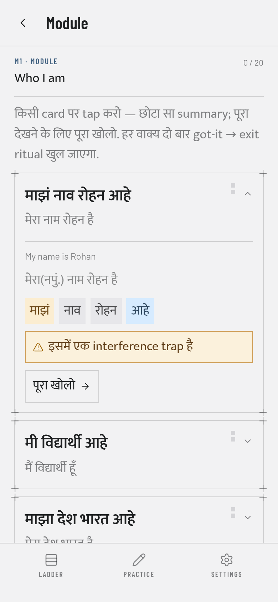

# PWA notes — manifest, the worker, offline gate (#90, rescoped #211)

What making `rung` a real PWA proved, and the evidence for the release gate in
`design/pwa-checklist.md` §3.6. This file is in `docs/`, not `design/`: `design/` is re-copied
wholesale from Rishabh's tooling, which wipes anything added to it
(`docs/design-contract.md`).

**Verdict in one line (#90, one fixture course):** a cold start with the origin server **killed**
and the browser put offline renders Ladder → Module → Sentence Detail with **57 requests, 57 of
them served by the service worker, 0 from the network and 0 failed**; the strict build precaches
**41 files (1,098,926 bytes / 1073.2 KiB)** and a dev-content build **55 files (1,225,818 bytes /
1197.1 KiB)**; Chrome reports **zero manifest errors and zero installability errors**.

**What #211 changed:** that worker precached the whole CATALOGUE, which was defensible when there
was one course and became a Spanish learner downloading Devanagari when there were three. The
worker now precaches the **shell** and caches the **active course** at runtime — §3 below is the
current shape, with the measurement; §4's walk is the record of the old worker and is dated as
such.

---

## 1. What ships

| Piece | Where |
|---|---|
| Plugin config — manifest, globs, workbox | `tools/pwa.ts` (`vite.config.ts` is one line: `VitePWA(pwaOptions())`) |
| Icons, generated from the header rails mark | `tools/make-icons.ts` → `public/icons/*.png`, committed |
| Registration | `src/pwa/registerServiceWorker.ts`, called from `src/main.tsx` |
| Storage durability | `src/state/durableStorage.ts`, the store's `storage` |
| iOS meta + favicon + theme colour | `index.html` |

Two values are never typed twice: the name comes from `src/brand.ts` and both manifest colours
plus `<meta name="theme-color">` come from `design/tokens.css` `--color-bg` (`tools/tokens.ts`,
and the `%THEME_COLOR%` substitution in `vite.config.ts`).

### The manifest is the checklist

`design/pwa-checklist.md` §3.1 prints the exact JSON, so `tools/pwa.test.ts` **parses that block
out of the checklist** and deep-equals it against what the plugin is handed. What `dist/` emits:

```json
{"name":"rung","short_name":"rung","description":"Climb a language, one checkpoint at a time.",
 "lang":"en",
 "start_url":"/","display":"standalone","background_color":"#f2f2f3","theme_color":"#f2f2f3",
 "id":"/","orientation":"portrait","icons":[
  {"src":"/icons/icon-192.png","sizes":"192x192","type":"image/png"},
  {"src":"/icons/icon-512.png","sizes":"512x512","type":"image/png"},
  {"src":"/icons/maskable-512.png","sizes":"512x512","type":"image/png","purpose":"maskable"}]}
```

Key for key, the checklist and nothing else. vite-plugin-pwa merges its own defaults *under* the
manifest it is given, which adds `lang: "en"` and `scope`; `scope` is set to `undefined` so it is
deleted from the emitted JSON, and nothing is lost — it defaults to the `start_url`'s directory
(`/`), which is the scope the worker registers with anyway.

`lang` was dropped the same way until #186, on the grounds that the document already declared
`lang="en"`. It does not any more: `CourseProvider` sets `documentElement.lang` to the active
course's L1, so a hi-mr install serves a `lang="hi"` document. The manifest therefore states its
own language explicitly — `"en"`, because `name` and `description` are English in every course
and there is no active course at install time to ask.

That is a **sanctioned divergence from the checklist**, the only one: §3.1 does not print `lang`,
and `design/` is read-only and wiped on re-copy (01-plan §10), so it is recorded here and encoded
in `tools/pwa.test.ts` (`expectedManifest()` = the parsed block + `lang`) rather than edited into
the package. Every other key is still the checklist, parsed and deep-equalled.

## 2. The icons are the header mark, read not redrawn

`src/shell/RailsMark.tsx` says its geometry is the ticket's verbatim SVG and is not to be
redrawn. So `tools/make-icons.ts` **reads that component** — the same source-scan idiom as
`src/fonts.test.ts` — lifts its five `<line>`/`<rect>` elements, resolves the colours the
component defers to the page (`currentColor` → `--color-text`, `var(--color-accent)`) out of
`design/tokens.css`, stands them on the `--color-bg` ground and rasterises with sharp. There is
no second copy of the mark anywhere: change the header and `npm run icons:build` follows it.

| File | Size | Mark height | Bytes |
|---|---|---|---|
| `icon-192.png` | 192 | 64% | 897 |
| `icon-512.png` | 512 | 64% | 3,182 |
| `maskable-512.png` | 512 | **50%** | 2,892 |
| `apple-touch-icon-180.png` | 180 | 64% | 799 |
| `favicon-32.png` | 32 | 64% | 285 |

**The maskable safe zone is arithmetic, not judgement.** A launcher may crop to a circle of 80%
of the icon's width, i.e. radius 0.4 × size. The mark's ink box is 9.5 × 17.5 in a viewBox of 20,
so at 50% height its own half-diagonal is `hypot(0.136, 0.25) = 0.284 × size` — inside 0.4 with
room to spare. `tools/make-icons.test.ts` asserts that number, and asserts the plain icons sit
*outside* it: they are never cropped, and a mark shrunk for a crop that will not happen is a
smaller mark for nothing.

`favicon-32.png` is here for an offline reason, not a cosmetic one — see §4.

> **#115 re-cut this set** from the ratified §6.4 construction grid after the header component
> adopted it — same pipeline, same five files, and the iOS splash set beside them. The bytes
> above are #90's receipt; §11 is the current one.

## 3. Precache the shell, cache the active course (#211)

`registerType: 'autoUpdate'`, workbox `generateSW`, `cleanupOutdatedCaches` on — and, since #211,
**two runtime routes** where there used to be none.

### 3.1 Why the invariant moved, and what it still promises

`tools/pwa.ts` used to say "precache everything, route nothing", and the reasoning was sound:
PRD-engineering §3/§10 is zero network after first load, so a request the precache cannot answer
is a bug in the app rather than a case for a network fallback. The flaw is not in the promise, it
is in the word *everything*. A precache manifest is baked at **build** time; the learner picks
their course at **run** time. "Everything" therefore meant the whole catalogue, and with three
courses that is a Spanish learner's phone holding hi-mr's 258 KiB of Devanagari for ever
(`docs/05-perf-notes.md` §4.8 recorded exactly this gap).

So the split is now:

| Layer | What it holds | Handler |
|---|---|---|
| **Precache** | the shell — document, bundles, CSS, the Barlow + Mukta **latin** faces, `content/courses.json`, `icons/*.png`, the manifest | workbox precache |
| **Runtime, course content** | `content/<id>/**.json` — the active course's ladder, strings, sizes, modules and indexes | `CacheFirst` |
| **Runtime, course faces** | that course's script subsets (`*-devanagari-*`, `*-arabic-*`) | `CacheFirst` |

**Cache-first, never network-first, and never stale-while-revalidate.** Both of those put a
request on the wire on every launch, which is the thing §10 forbids. After the warm there is
still zero runtime network for the active course — the same promise, kept for the course the
learner actually chose. Freshness is the cache **name**'s job, not a revalidation's: the content
cache is `rung-course-content-<hash of the emitted content tree>` (`contentRevision()` in
`tools/pwa.ts`, handed to both the worker and the app by `vite.config.ts`), so a build that
changes a course's bytes writes a new cache and drops the old one, and a build that does not
re-downloads nothing. The font subsets need no revision — Vite hashes their filenames.

**The warm** is `src/pwa/offlineCourse.ts`, called from `CourseProvider` the moment a course
resolves — which is also the course-**switch** path. It fetches every file the course ships (all
of them, not the screens the learner opened, so the ladder is browsable offline from the first
online visit), then asks `document.fonts.load()` for every declared face using the characters
that content actually carries. `unicode-range` does the scoping, so nothing here branches on a
course id (Invariant 1). One subtlety worth writing down: the sample **drops whitespace and
format characters**, because those are in more than one face's range by design — the Naskh face
declares `U+0020` deliberately (`src/fonts/naskh.css`) and both Mukta Devanagari and Naskh claim
`U+200C-200E`. Sample raw and every course "proves" it is written in Arabic. With the filter, the
courses ask for exactly their own script:

    hi-mr → mukta-devanagari (+ the precached latin)   en-es → nothing but the precached latin
    en-ar → noto-naskh-arabic (+ the precached latin)

**What this trades away, plainly.** The offline promise moves from "everything, the moment the
worker installs" to "the learner's own course, from the first time it is opened online". Install
the app, switch to a course you have never opened, and go offline before the warm finishes, and
that course has no content — where the old worker would have had it. The learner's own course is
warmed on every launch and re-warmed after every content change.

### 3.2 What the emitted worker precaches, measured

`dist/sw.js` after `scripts/verify.sh`, three real courses (hi-mr, en-es, en-ar), no fixtures:

    before #211 (whole catalogue)         after #211 (shell only)
    html            1       5,178 B       html            1       5,178 B
    js              2     281,915 B       js              2     283,539 B
    css             1      54,137 B       css             1      54,137 B
    woff2          10     383,584 B       woff2           6     108,928 B
    json           70   1,278,659 B       json            1       1,265 B
    png             5       8,034 B       png             5       8,034 B
    webmanifest     1         470 B       webmanifest     1         470 B
    TOTAL          90   2,011,977 B       TOTAL          17     461,551 B

**90 entries → 17.** The four woff2 that left are the three Mukta Devanagari weights and the Noto
Naskh Arabic face; the 69 JSON that left are the three courses' ladders, strings, sizes, modules
and indexes. `content/courses.json` stays: it is the manifest every learner in every course boots
from, so it is shell, and the content route is written to *exclude* it (answering it out of a
course's cache would hand a learner the catalogue of whichever course they opened last).

What each course then pulls at runtime, on open:

    hi-mr   23 json  479,594 B  +  3 woff2  264,168 B  =  26 files  743,762 B
    en-es   23 json  356,551 B  +  0 woff2        0 B  =  23 files  356,551 B
    en-ar   23 json  441,249 B  +  1 woff2   10,488 B  =  24 files  451,737 B

`sw.js` and `workbox-*.js` are shell bytes and are the one thing in the shell row that is never
*in* the precache — workbox does not precache itself; the browser keeps a worker's script in the
registration. `tools/payload-budget.ts`'s `precacheAudit()` names them and then asserts the rest
as an equality, so the `BUDGET precache 17 files 207.3 KiB gzip = shell ok` line at the end of
every `scripts/verify.sh` is read off the emitted worker rather than off this table.

**A strict build precaches one content file, `courses.json`.** With three verified courses it now
lists all three; when every module in `content/` was `verified: false` it said `{"courses": []}`
(the native gate, #64 — README, "The content gate"). The §4 walkthrough below was run in that era
and therefore against a **dev-content build**, the only build that then had a module to browse.

## 4. The offline gate (checklist §3.6)

> **Dated: this is the #90 record, run against the precache-everything worker and one fixture
> course.** #211 rescoped the worker (§3), and the walk has **not** been re-run: browser
> automation is banned on the machine that hosts this repo, so re-running it needs the LAN
> (`http://<pi>:<port>`) or a phone — the same bucket as §8's deferred items. What can be said
> without a browser is said in §3.2 and is machine-checked: the emitted worker precaches exactly
> the shell (`BUDGET precache … = shell ok`, gated in `scripts/verify.sh`), the two runtime routes
> are both `CacheFirst` with no network preference (`tools/pwa.test.ts`), and the warm fetches
> every file a course ships and only its own script's faces (`src/pwa/offlineCourse.test.ts`).
> The step of the walk this cannot stand in for is the one that matters most — a **cold** start,
> server dead, on a course that has been opened once before. That is the acceptance test to run
> on the next device pass.

No phone is attached to this machine, so the gate was run headlessly against Chromium 151 over
CDP. It is stricter than airplane mode in one way that matters: **the origin server is killed
between the two phases**, so there is no server to answer even if the emulation leaked.

```
1. npm run content:build -- --with-unverified --with-fixtures && npx vite build
2. npx vite preview --port 4173 --host 127.0.0.1
3. chrome --headless=new --user-data-dir=<fresh profile>  → load http://127.0.0.1:4173/
     wait for navigator.serviceWorker.ready, poll caches until the entry count settles
4. Browser.close (flushes the profile), then kill the preview server
     curl http://127.0.0.1:4173/  →  exit 7, connection refused
5. relaunch chrome on the SAME profile  →  COLD start, new process, new tab
     Network.emulateNetworkConditions {offline: true} BEFORE the first navigation
     Target.setAutoAttach, so the service-worker target is put offline and recorded too
6. walk it, recording every Network.* event
```

Phase 3 reported `controller: /sw.js`, `active: activated`, and one cache —
`workbox-precache-v2-http://127.0.0.1:4173/` — holding all **55** entries.

### The walk, offline, cold

| # | Step | Screenshot |
|---|---|---|
| 1 | Boot at `/` → Ladder: level strip, current rung, ownership footer |  |
| 2 | Click the rung card's CTA → `#/module/L1-M1`, ten sentence cards |  |
| 3 | Expand a card, click "open full" → `#/sentence/L1-M1-S01` |  |
| 4 | Reload, still offline → same route, still controlled | — |
| 5 | Cold deep link `about:blank` → `/#/module/L1-M1` |  |

**Result: 57 requests · 57 `fromServiceWorker` · 0 from the network · 0 failed.** Every shell
asset, all ten used woff2 faces, `courses.json`, `hi-mr/levels.json`, `hi-mr/strings.json`,
`hi-mr/modules/L1-M1.json`, the manifest and `icon-192.png` came out of the precache with the
server dead. Devanagari renders — the faces are bundled, so there is no fallback to system and no
tofu (`docs/04-font-notes.md` §3).

Two things this found, both fixed here:

- **`/favicon.ico`.** A document that declares no icon makes the browser guess that path, which
  nothing precaches: the first run showed five `net::ERR_INTERNET_DISCONNECTED` failures, one per
  screen. `index.html` now declares `/icons/favicon-32.png`, which is precached. Zero failures.
- **A *force* reload bypasses the worker.** `Page.reload {ignoreCache: true}` is shift-reload
  semantics, and the spec says it goes straight to the network — offline that is one failed
  request for `/`, after which the browser retries through the worker and the page loads anyway.
  Browser behaviour, not an app gap; a normal reload (step 4) is 100% worker.

`navigator.onLine` reads `true` throughout: Chrome 151 does not flip it for CDP network
emulation. It is a hint, not the gate — the gate is that the server is dead and Chrome reports
every response as coming from the worker.

## 5. Installability

**Lighthouse could not answer this.** Lighthouse removed the PWA category in v12; on v13.4.1 the
audits `installable-manifest`, `service-worker`, `maskable-icon` and `apple-touch-icon` no longer
exist and a run requesting them returns zero audits. So the verdict comes from Chrome itself, via
CDP against the preview build:

```
Page.getAppManifest        → errors: []
Page.getInstallabilityErrors → installabilityErrors: []
```

Zero parse errors, zero installability errors, manifest resolved at
`/manifest.webmanifest`, scope `/`.

## 6. Storage durability (checklist §3.5)

`src/state/durableStorage.ts` wraps `localStorage` for the store and asks
`navigator.storage.persist()` **once, after the first write** — asking before there is anything
to keep is asking to protect an empty box, and asking on every save would be a permission prompt
in the browsers that show one. The outcome is logged and nothing else: there is no second storage
to fall back to, and F7's manual export is the real answer to durability. What the log buys is an
explanation on the day a ladder does vanish.

Headless Chrome, unsurprisingly, declines — the console line on every run above is:

    rung: storage persistence denied — progress is evictable (F7 export is the backup)

Chrome grants it outright for an *installed* PWA, which is the state this app is meant to be in
and is exactly what a headless profile is not.

## 7. `npm run dev` is untouched

`devOptions.enabled: false`, so no worker is generated or served in development and HMR is never
fighting a cache. Verified on a running dev server: `virtual:pwa-register` resolves to the
plugin's stub (`function registerSW() { return async () => {} }`), `index.html` carries no
`<link rel="manifest">` and no registration script, and `/sw.js` is Vite's SPA fallback
(`Content-Type: text/html`) rather than a worker. The worker exists in `build` and `preview`.

## 8. Deferred — needs a physical device

Nothing below is claimed by this ticket:

- **A real Add-to-Home-Screen install**, and how the icons look on an actual launcher and iOS
  home screen — headless Chrome can report installability, not the install (#91, #115).
- **`black-translucent` in practice**, and the splash set on a real cold standalone launch —
  the images ship (#115, §11), but the status bar only overlays the app and the splash only
  shows once installed and launched from the home screen.
- **Safari's own offline behaviour**, and the Chrome-Android/Safari-iOS current-1 test matrix
  (checklist §3.7, PRD-engineering §10). This gate is Chromium on a Pi.
- **The later phases of the gate** — "run a session, complete a ritual, export backup"
  (checklist §3.6) — those screens do not exist yet (#95, #103, F7).

## 9. The sub-path audit (#91)

The Pages deploy is a **project site**, so the build runs `VITE_BASE=/rung/` and every URL the PWA
owns has to land under it. Four mechanisms, and only one of them was wrong:

| What | Who resolves the base | Verdict |
|---|---|---|
| `content/*.json` fetches | the app, per call: `` `${import.meta.env.BASE_URL}${path}` `` | already right (#79/#81) |
| `index.html` — favicon, apple-touch-icon, the bundles | Vite, at build: source stays `/icons/…`, `dist/` reads `/rung/icons/…` | already right |
| Worker registration + precache | vite-plugin-pwa: registers `/rung/sw.js` with `{ scope: '/rung/' }`; every precache URL is **relative** (`index.html`, `assets/…`), so it resolves against the worker's own directory — as does `navigateFallback: 'index.html'` | already right |
| **`manifest.webmanifest`** | **nobody** — it is JSON the plugin copies through | **was wrong** |

The manifest is the silent one. `id`, `start_url` and all three icon `src`s were typed as `/…`,
which on a sub-path resolves against the **origin root**: an installed app whose launch icon 404s
and whose `start_url` opens `https://rishabh7g.github.io/` — somebody else's page, with no worker.
So `tools/pwa.ts` now takes the base and builds every path from it (`pwaManifest(base)`), and
`tools/pwa.test.ts` asserts the sub-path manifest is the checklist with `/rung` in front of each
path, that `id`/`start_url` are the base, and that no icon points above it. `scope` is still
deleted, and still correct: the browser derives it from `start_url`'s directory, which is now
`/rung/` — the same scope the worker registers with.

What `VITE_BASE=/rung/ npm run build` emits:

```json
{"start_url":"/rung/","id":"/rung/","icons":[{"src":"/rung/icons/icon-192.png", …}]}
```

## 10. Reproducing

```bash
npm run icons:build                                    # regenerate public/icons from the header mark
npm run content:build -- --with-unverified --with-fixtures
npx vite build && npx vite preview --port 4173         # a worker only exists in a build
VITE_BASE=/rung/ npm run build                         # what the deploy builds (strict, sub-path)
```

Then: load once online, kill the preview server, cold-start the browser against the same profile
with the network off, and walk Ladder → Module → Sentence Detail. Every response should report
`fromServiceWorker`.

## 11. The ratified mark, the final icons, the iOS splash set (#115)

#69's formal spec landed the mark's construction grid in `design/tokens.md` §6.4 — a 22-unit
square: rails at x 5.5/16.5 (y 1 → 21), outer rungs at y 4.5/17.5, hairline 1.5, and the middle
rung the one solid object, a 3-unit accent bar. `src/shell/RailsMark.tsx` now carries that grid
verbatim (it had shipped the interim 20-grid hairline version), so the header, the icons and the
splash all changed together in the one place the mark lives. `npm run icons:build` re-cut the
five icons from it — same sizes, same mark heights, ~2.8–3.2 KB apiece.

The maskable arithmetic §2 explains moved with the geometry: the ink box is now 12.5 × 21.5 in a
viewBox of 22, so at 50% height the box's half-diagonal is **0.289 × size** — still well inside
the 0.4 safe radius, still asserted as a number in `tools/make-icons.test.ts`.

**The splash set** (`npm run splash:build` → `tools/make-splash.ts`) is the checklist §3.3 item
#90 deferred. iOS ignores the manifest's `background_color`, so a cold standalone launch flashes
white unless an `apple-touch-startup-image` matches the device's EXACT size. Eleven portrait
iPhone viewports (SE → 17 Pro Max, ~70 KiB in total, `public/icons/splash/`), each the header
lockup at 5% of the screen height — mark read out of `RailsMark.tsx` by make-icons' parser, the
wordmark `BRAND` set in the real Barlow Condensed 700 (converted woff2 → TTF at generation time
because Pango reads no woff2), `--color-text` on exactly `--color-bg`. No iPad rows and no
landscape: the product targets P1's phone and the manifest pins `orientation: portrait`.

Three deliberate boundaries, each with a test in `tools/make-splash.test.ts`:

- **`index.html` is cross-checked against the generator** — one `<link>` per device, exact media
  query, exact filename; a device row added without its link (or vice versa) is a red test.
- **The set is NOT precached.** The app never fetches a splash image — Safari does, once, at
  Add-to-Home-Screen. The precache glob is `icons/*.png`, whose `*` does not cross into
  `icons/splash/`; precaching would cost every Android first visit ~70 KiB it can never use.
- **The budget follows the same truth** (`tools/payload-budget.ts`): the splash set is its own
  owner, so no learner-facing row counts it (it is not first-visit payload and it is not
  precached), and a `splash` row meters it raw, ≤ 100 KiB. #207 replaced the catalogue-wide
  `total` row with per-course rows and kept that carve-out exactly as it was.

Not claimed here, as in §8: how the set looks on a physical iPhone. The install-and-cold-launch
walkthrough on both platforms is the device-bound tail of #115.
